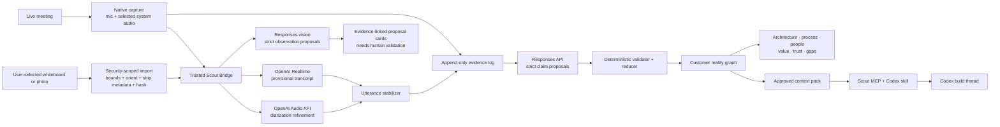
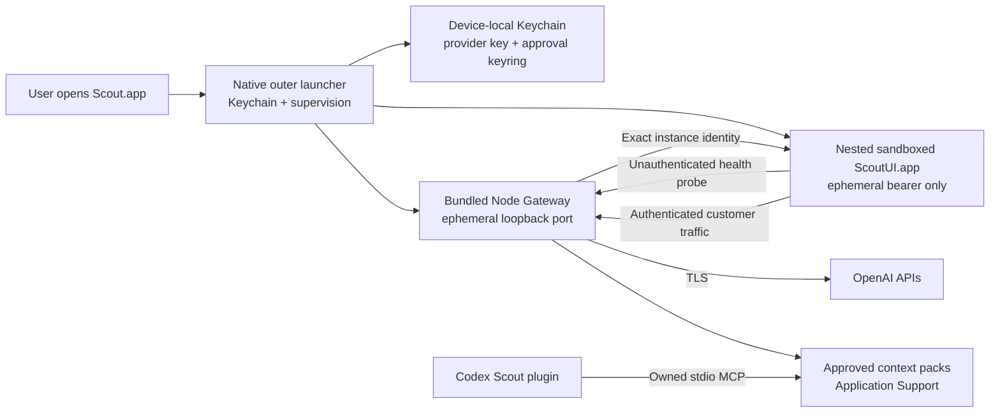
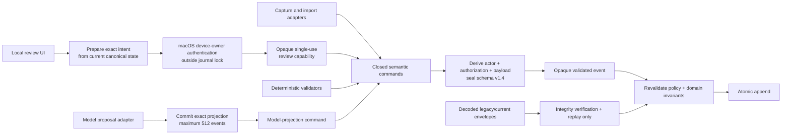
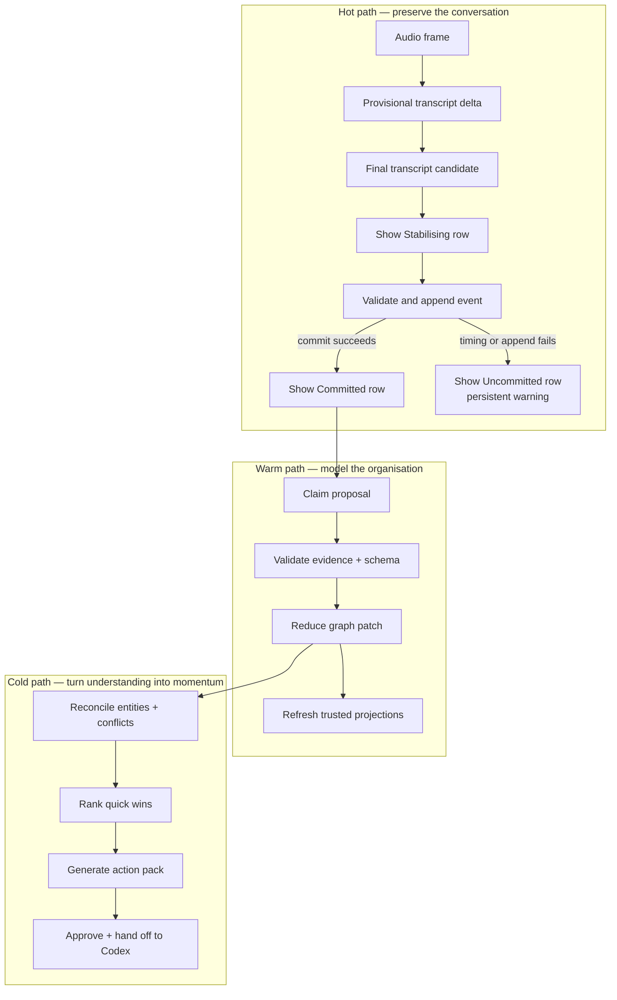

# Scout architecture

## System shape

## Packaged process boundary

The launcher never passes the provider key or approval private keyring to the UI. It generates a fresh
Gateway bearer, approval token, instance identity, and loopback port for every launch. The UI sends no
bearer or customer bytes until the same origin returns that exact identity. The bundled Gateway and UI
are one supervised failure domain.

## Truth layers

1. **Evidence** — immutable anchors for finalized utterances, normalized-image digests, documents, or
   manual sources. Raw PCM itself is transient and is not part of the retained evidence log.
2. **Utterances** — versioned transcription and diarization observations.
3. **Claims** — atomic propositions with attribution, modality, confidence, and evidence.
4. **Reality graph** — the deterministic, revisable materialization of reducer-valid claims and relationships. Each item retains its trust and validation state; presence in the graph does not mean human confirmation.
5. **Projections** — diagrams, summaries, gaps, questions, opportunities, and action packs.

A projection is never a source of truth. A recording-derived anchor or an explicitly retained external
recording is evidence, not automatically truth; Scout's raw PCM is transient. A model response is a
proposal, not state.

## Canonical write authority

`EventActor` records attribution, not permission. New writes use the current schema and can reach the
store only as opaque validated events created from a closed command scope. Model commands cannot
select review or maintenance operations; their proposals must remain suggested and bind to an exact
model-call receipt. At schema v1.4, that receipt also commits the exact contiguous, atomic sequence of
at most 512 derived events. The rolling commitment binds the adapter contract, projection base, event
count, order, identifiers, payload kinds, and canonical payload hashes. Their evidence must predate
the receipt's input boundary, and they cannot overwrite protected graph state, reactivate retired
entities, recreate removed relationships, or supersede reviewed claims. Evidence recorders and model
claim speakers are derived or checked against canonical utterances. Decoded historical envelopes
remain replayable but are not appendable.

Local review has no public command case. Core first binds one proposed claim or visual observation,
its proposal event, current state hash, session, future event, and exact terminal operation into an
intent. A fresh macOS `deviceOwnerAuthentication` prompt exchanges that intent for an opaque runtime
capability while the journal lock is released. Cancellation invalidates the one-shot authentication
context and cannot strand a FIFO journal waiter. Append reacquires the lock and rejects a changed
target, different operation or session, grant older than five minutes, future-dated grant, or reused
grant; the store repeats the age check against its actual append clock. The non-secret audit record is
hash-bound into the event and revalidated during replay. A legacy terminal decision is upgraded only
by a separate `localReview.attested` event bound to its original review event and unchanged terminal
state. The decision itself is never rewritten.

This boundary still trusts linked Scout application code. Component names provide audit provenance;
they do not authenticate callers. Untrusted Gateway, plugin, transcript, image, and model data reaches
it only through deterministic adapters. Device-owner authentication is not named-person identity or
an independent signature against malicious code already inside the application trust boundary. A
derived-event manifest proves which events the adapter declared and Scout committed, not that the
adapter accounted for every source item in the provider output.

## Fast and deliberate loops

## Reliability rules

- Event ordering uses a monotonic sequence, never wall-clock ordering.
- Event schema versions are monotonic within each stream. A v1.4 stream cannot append a lower-schema
  envelope to regain historical authorization behavior.
- New canonical writes use the current event schema and carry a hash-bound authorization record;
  older schema versions are replay-only.
- Stores accept only opaque validated events. Actor, authorization scope, and payload compatibility
  are rechecked by the reducer inside the atomic append transaction.
- Partial transcript deltas are ephemeral. A final candidate can appear immediately as `Stabilising`,
  but it becomes a semantic event and `Committed` row only after deterministic journal persistence.
  Missing immutable timing or append failure produces an `Uncommitted` row and persistent warning;
  transcript finality never implies durability.
- Selecting an archived session sends an idempotent stop request to the live coordinator regardless of
  the projected UI state. In-flight startup is cancelled; active producers stop and transcripts drain;
  the coordinator publishes paused only when that lifecycle completes. Demo playback stops locally.
- Every claim-extraction and image-observation call records its input boundary, schema version, prompt
  version, model, response identifier, and output hash. Schema-v1.4 receipts also commit the exact
  adapter version, projection base, derived-event count, and rolling event root. A dedicated
  diarization receipt is still pending.
- Model-derived evidence references must resolve to evidence committed at or before the recorded model
  input boundary; later evidence cannot be attributed to an earlier response.
- Relationship removals retain reducer tombstones, and reviewed-claim references transitively protect
  entity and relationship semantics from later model overwrites.
- Replay consumes recorded model commitments; replay never contacts OpenAI or macOS authentication.
  It rejects incomplete, extra, reordered, or substituted manifested projections and inconsistent
  local-review audit records.
- Exact provider retries are regenerated from the original projection-base prefix and compared with
  the complete persisted batch. Application views are replaced from canonical replay state, never
  from a repeated adapter object. Image retries additionally rebind asset identity, media type,
  content hash, dimensions, byte count, and provider response identity to persisted evidence.
- Manifested model projections apply as one contiguous atomic batch. One invalid operation rejects
  the receipt and its entire projection.
- UI projections are disposable. On launch, Scout verifies and replays the encrypted journal to rebuild the latest workspace state.
- Verified replay snapshots are an optimisation, never authority. Their aggregate LRU is bounded to
  8 streams, 8,192 events, and a conservative 64 MiB retained-byte proxy; oversized snapshots remain
  correct but are not cached, and cross-connection commits invalidate cached generations.
- Schema 1.3 adds command-authorization indexes and removal tombstones; schema 1.4 adds exact model
  projection progress, proposal-event indexes, and consumed local-review authorizations. Upgrading a
  persisted snapshot requires a full journal rebuild until versioned snapshot migration exists.
  Schema 1.0–1.3 history remains integrity-verified and replayable, but is explicitly unattested for
  v1.4's exact-projection and device-owner-review guarantees; schema 1.0–1.2 also lacks command
  authorization. Legacy accepted claims and visual confirmations remain validation-required and
  cannot enter a build-ready handoff until append-only re-attestation succeeds.
- A crash after event commit but before a UI refresh repairs itself through replay.
- The append-only model can retain conflicting stakeholder claims, but automatic conflict detection
  and a first-class contested/resolved projection are not implemented. The UI must preserve both
  claims and present resolution as an operator task rather than silently selecting one.
- The event store is encrypted with one non-synchronizing, device-bound Keychain key. Imported visual evidence has explicit retention boundaries. Per-engagement key shredding and plaintext-to-encrypted database migration are not implemented yet and remain deployment work.
- Approved context packs use Ed25519. Keychain retains one active private seed; rotation deletes the
  former seed and retains only its public key for compatibility. The launcher publishes a versioned
  non-secret public keyring in Application Support, so the standalone MCP is cryptographically
  verification-only. Revocation removes a key from subsequently published verification state.
- Codex access is stdio-only. No HTTP MCP listener exists, and every approved read revalidates the
  Gateway approval binding.

## OpenAI allocation

- **Realtime transcription:** the Gateway opens the provider's transcription-intent Realtime session,
  then configures `gpt-4o-mini-transcribe` under `audio.input.transcription` for the low-latency
  provisional text stream. Scout performs local segmentation and reconciles completions by stable item ID.
- **Diarization:** `gpt-4o-transcribe-diarize` through `/v1/audio/transcriptions`, producing speaker-labelled finalized segments. It refines history through appended revisions.
- **Claims:** Responses API Structured Outputs with a strict JSON Schema. A deterministic validator owns foreign keys, evidence spans, enums, and idempotency. The current default claims model is account-specific and must be verified in the target OpenAI project before release.
- **Images:** one explicitly selected JPEG, PNG, HEIC, or HEIF source is decoded under byte, frame, dimension, pixel, and memory bounds; orientation is applied and metadata-bearing JPEG segments are removed. The Gateway rechecks the normalized byte hash and dimensions before a non-persistent Responses vision call. Entities, relationships, and notes are shown only as evidence-linked proposal cards; the current build has no path that promotes them into graph state.
- **Post-call reasoning:** a slower reasoning model can generate opportunity assessments and POC drafts, but every score basis remains evidence-linked and reviewable.

## Engineering targets (not yet production-benchmarked)

| Boundary | Target |
| --- | ---: |
| Local event append p95 | < 25 ms |
| Provider delta to transcript display p95 | < 500 ms |
| Final utterance to first graph proposal p95 | < 5 s |
| Incremental reducer p95 | < 16 ms |
| Warm recovery for a two-hour session | < 2 s |
| Full replay of 100k semantic events | < 10 s |
