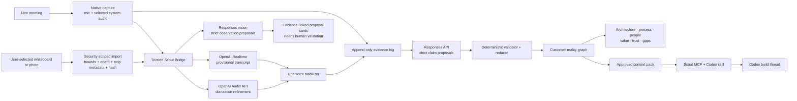
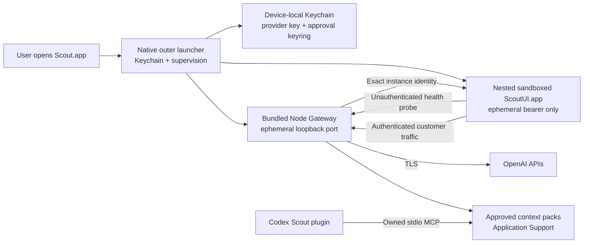
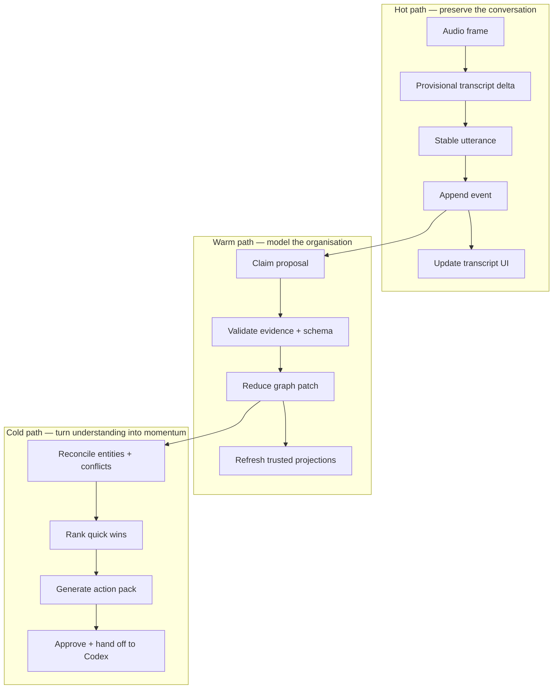

# Scout architecture

## System shape

## Packaged process boundary

The launcher never passes the provider key or approval HMAC keyring to the UI. It generates a fresh
Gateway bearer, approval token, instance identity, and loopback port for every launch. The UI sends no
bearer or customer bytes until the same origin returns that exact identity. The bundled Gateway and UI
are one supervised failure domain.

## Truth layers

1. **Evidence** — immutable anchors for finalized utterances, normalized-image digests, documents, or
   manual sources. Raw PCM itself is transient and is not part of the retained evidence log.
2. **Utterances** — versioned transcription and diarization observations.
3. **Claims** — atomic propositions with attribution, modality, confidence, and evidence.
4. **Reality graph** — the deterministic, revisable materialization of reducer-valid claims and relationships. Each item retains its trust and validation state; presence in the graph does not mean human confirmation.
5. **Projections** — diagrams, summaries, gaps, questions, opportunities, and action packs.

A projection is never a source of truth. A recording-derived anchor or an explicitly retained external
recording is evidence, not automatically truth; Scout's raw PCM is transient. A model response is a
proposal, not state.

## Fast and deliberate loops

## Reliability rules

- Event ordering uses a monotonic sequence, never wall-clock ordering.
- Partial transcript deltas are ephemeral. Only finalized utterance revisions are semantic events.
- Every claim-extraction and image-observation call records its input boundary, schema version, prompt version, model, response identifier, and output hash. A dedicated diarization receipt is still pending.
- Replay consumes recorded model outputs; replay never contacts OpenAI.
- Graph patches apply atomically. One invalid operation rejects the whole proposal.
- UI projections are disposable. On launch, Scout verifies and replays the encrypted journal to rebuild the latest workspace state.
- A crash after event commit but before a UI refresh repairs itself through replay.
- Conflicting stakeholder claims coexist and surface as contested until validation resolves them.
- The event store is encrypted with one non-synchronizing, device-bound Keychain key. Imported visual evidence has explicit retention boundaries. Per-engagement key shredding and plaintext-to-encrypted database migration are not implemented yet and remain deployment work.
- Approved context-pack HMAC keys use a Keychain keyring. Rotation activates a new signer while old
  keys remain verify-only, so immutable packs do not need to be rewritten.
- Codex access is stdio-only. No HTTP MCP listener exists, and every approved read revalidates the
  Gateway approval binding.

## OpenAI allocation

- **Realtime transcription:** `gpt-realtime-whisper` for the lowest-latency provisional text stream. Scout performs local segmentation and reconciles completions by stable item ID.
- **Diarization:** `gpt-4o-transcribe-diarize` through `/v1/audio/transcriptions`, producing speaker-labelled finalized segments. It refines history through appended revisions.
- **Claims:** Responses API Structured Outputs with a strict JSON Schema. A deterministic validator owns foreign keys, evidence spans, enums, and idempotency.
- **Images:** one explicitly selected JPEG, PNG, HEIC, or HEIF source is decoded under byte, frame, dimension, pixel, and memory bounds; orientation is applied and metadata-bearing JPEG segments are removed. The Gateway rechecks the normalized byte hash and dimensions before a non-persistent Responses vision call. Entities, relationships, and notes are shown only as evidence-linked proposal cards; the current build has no path that promotes them into graph state.
- **Post-call reasoning:** a slower reasoning model can generate opportunity assessments and POC drafts, but every score basis remains evidence-linked and reviewable.

## Engineering targets (not yet production-benchmarked)

| Boundary | Target |
| --- | ---: |
| Local event append p95 | < 25 ms |
| Provider delta to transcript display p95 | < 500 ms |
| Final utterance to first graph proposal p95 | < 5 s |
| Incremental reducer p95 | < 16 ms |
| Warm recovery for a two-hour session | < 2 s |
| Full replay of 100k semantic events | < 10 s |
